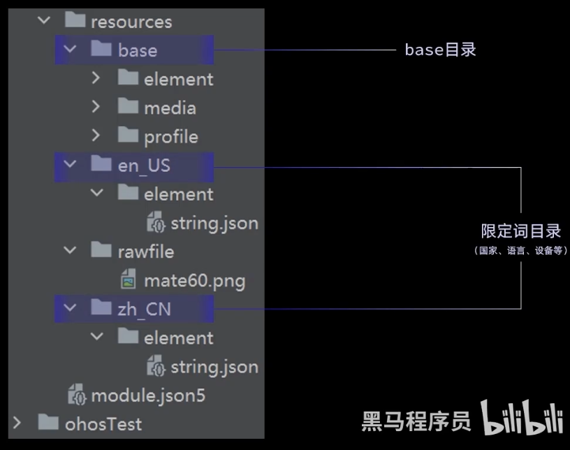
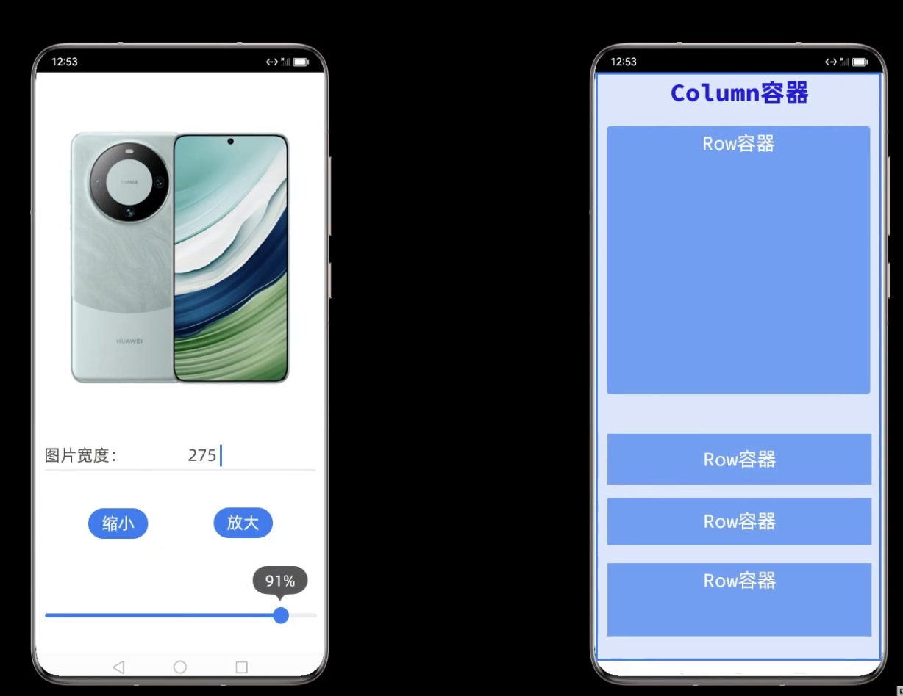
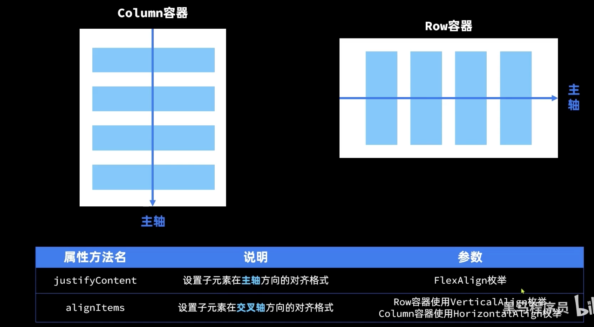
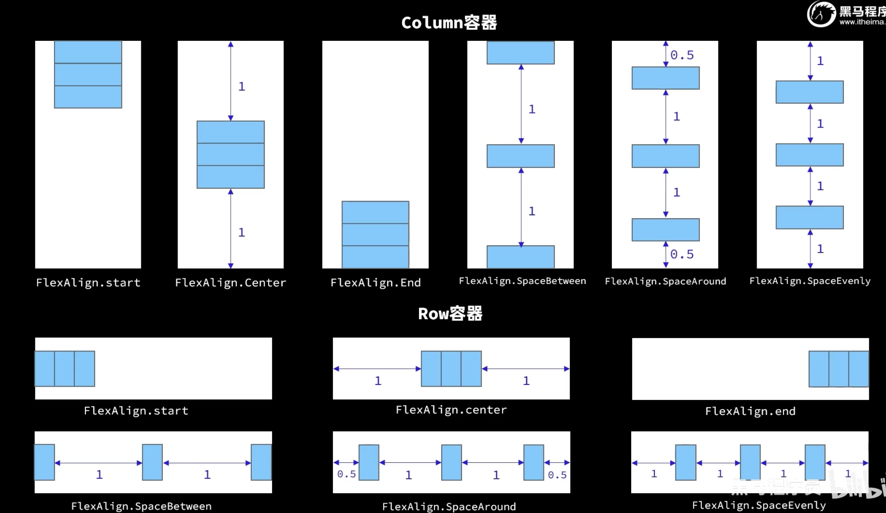
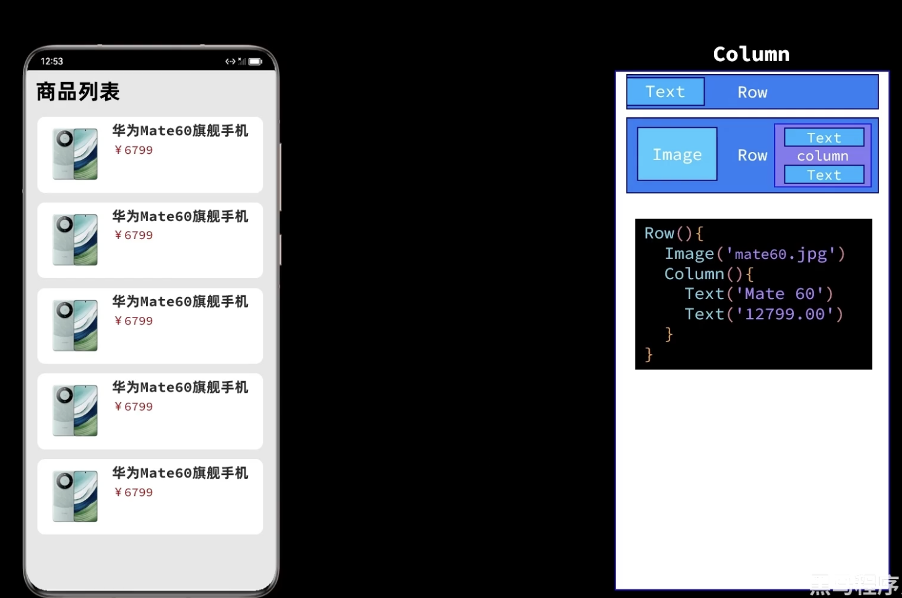

# Harmony-OS Study

## 05. ArkUI组件 - Image

Image：图片显示组件

1. 声明Image组件并设置图片源

   ```java
   Image(src:string | PixelMap | Resource)
   ```

- string格式，通常用来加载网络图片

  - 需要申请网络访问权限：ohos.permission.INTERNET

  ```java
  # module.json5文件中配置 
  {
    "module": {
      "requestPermissions": [
        {
          "name": "ohos.permission.INTERNET",
        }
  ]}}  
  ```

  ```java
  # 网络请求情况Image('http://gips1.baidu.com/it/u=1971954603,2916157720&fm=3028&app=3028&f=JPEG&fmt=auto?w=1920&h=2560')
            .width(250)
            .height(250)
            .interpolation(ImageInterpolation.High)
  ```

- PixelMap，通常用来加载像素图，常用在图片编辑中

  ```java
  # 不常用
  Image(pixelMapObject)
  ```

- Resource格式，加载本地图片，推荐使用

  ```java
  Image($r('app.media.mate60'))
  Image($rawfile('mate60.png'))
  ```

2. 添加图片属性

   ```java
   Image($r('app.media.icon'))
     .width(100) //宽度
     .height(120) //高度
     .borderRadius(10) //边框圆角
     .interpolation(ImageInterpolation.High) //图片插值
   ```

## 06. ArkUI组件 - Text

1. 声明Text组件并设置文本内容

   ```java
   Text(content?:string|Resource)
   # string格式，直接填写文本内容
   Text('图片宽度')
   # Resource格式，读取本地资源文件  
   Text($r('app.string.width_label'))  
   ```

​	HarmonyOS - Application - Structure

</img>

2. 添加文本属性

   ```java
   Text($r('app.string.width_label'))
     .fontSize(50)
     .fontWeight(FontWeight.Bold)
     .fontStyle(FontStyle.Italic)
     .width('100%')
     .textAlign(TextAlign.Center)
   ```

## 07. ArkUI组件 - TextInput

1. 声明 TextInput 组件

   ```javascript
   TextInput({placeholder?:ResourceStr,text?:ResourceStr})
   ```

   - placeHolder：输入框无输入时提示的文本

     ```typescript
     TextInput({placeholder:'请输入账号或手机号'})
     ```

2. TextInput组件属性

   ```java
   TextInput({placeholder:'请输入账号或手机号'})
     .align(Alignment.Center)
     .width(200) //宽度
     .height(50) //高度
     .backgroundColor('#FFF') //背景色
     .type(InputType.PhoneNumber) //输入类型
     .onChange(value =>{
       // 文本输入框内部文字更改事件
       this.imgHeight = parseInt(value);
       this.imgWidth = parseInt(value);
      })
   ```

## 08. ArkUI组件 - Button

1. 声明Button组件

   ```javascript
   Button(label?:ResourceStr)
   ```

   - 文字型按钮

     ```java
     Button('click me')
     ```

   - 自定义按钮，在Button内嵌套其他组件

     ```java
     Button(){
       Image($r('app.image.search')).width(20).margin(10)
     }
     ```

2. 添加属性和事件

   ```javascript
   Button('Click Me to make img small')
     .type(ButtonType.Capsule)
     .width(200)
     .height(30)
     .margin(10)
     .onClick(() => {
     	if (this.imgHeight > 10 && this.imgWidth > 10) {
         this.imgWidth -= 10;
         this.imgHeight -= 10;
       }
   	})
   ```

## 09. ArkUI组件 - Slider

1. 声明Slider组件

   ```java
   Slider({
     min:0,   //最小值
     max:100, //最大值
     value:30,//当前值
     step:10, //滑动步长
     style:SliderStyle.OutSet, //InSet
     direction:Axis.Horizontal,//Vertical
     reverse:false  //是否允许反向滑动
   })
   ```

2. Slider属性

   ```javascript
   Slider({
     min:0,   //最小值
     max:100, //最大值
     value:30,//当前值
     step:10, //滑动步长
     style:SliderStyle.OutSet, //InSet
     direction:Axis.Horizontal,//Vertical
     reverse:false  //是否允许反向滑动
   }).width(250)
     .showTips(true) //是否展示当前value百分比
     .onChange(value=>{
     	this.imgHeight = value;
     	this.imgWidth = value;
      })
   ```

## 10. ArkUI组件 - Column && Row页面布局

1. 线形布局组件：Column && Row

</img>

</img>

2. 重点项提取：

- column容器 主轴方向 == 垂直向
-    Row容器   主轴方向 == 平行向

- 主轴的方向对齐：justifyContent  枚举项 FlexAlign
- 交叉轴方向对齐：alignItems        枚举项  Row 用 VerticalAlign
- ​                                                             Column 用 HorizontalAlign

</img>

3. 调整内左边距，内右边距

   ```javascript
   // 此调整，上下左右边距都为20
   .padding(20)
   
   // 更加精细
   .padding({
     top:20,
     bottom:20,
     left:20,
     right:20
   })
   ```

4. 鸿蒙自带分隔符

   ```javascript
   divider()
   ```

5. 调整行 (Row) 与行 (Row) 之间的间距

   ```java
   Column({space:20}){
     Row();
     Row();
   }
   ```

6. 调整外边距

   ```java
   .margin({
     top:50,
     bottom:20,
     left:20,
     right:20
   })
   ```

## 11. ArkUI组件 - 循环控制

</img>

```javascript
// 声明要循环的数组
class Item {
  name : string
  image : ResourceStr
  price : Number

 	constructor(
  	name:string,
    image:ResourceStr,
    price:Number) {
    	this.name = name
    	this.image = image
    	this.price = price
  }
}

private items: Array<Item> = [
  new Item('Mate60', $r('app.media.mate60'),6999),
  new Item('MateBook', $r('app.media.matebookXPro'),13999),
  new Item('WatchGT4', $r('app.media.WatchGT4'),1438),
  new Item('FreeBuds3', $r('app.media.FreeBuds'),1499),
  new Item('Mate X5',$r('app.media.mateX5'),3799)
]
```

```javascript
// ForEach循环遍历数组，根据数组内容渲染页面组件
Row(){
  ForEach(
    this.items,
    item => { //页面组件生成函数
      Column(){
        Image(item.image)
          .height(30)
        Text(item.name)
          .fontSize(10)
        Text('¥'+item.price)
          .fontSize(10)
          .fontColor('#F36')
      }
      .layoutWeight(1)
    }
  )
}
```

## 12. ArkUI组件 - List

列表（List）是一种复杂容器，具备下列特点：

- 列表项（ListItem）数量过多超出屏幕后，会自动提供滚动功能；
- 列表项（ListItem）既可以纵向排列，也可以横向排列；
